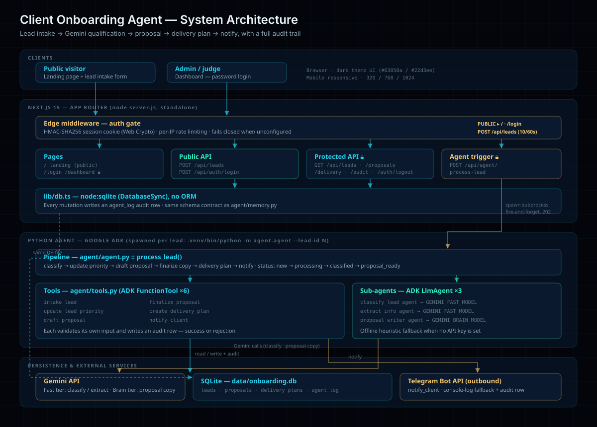

# Client Onboarding Agent

**AI agent that removes client onboarding friction — lead to proposal to delivery.**

[](https://github.com/google/adk-python)
[](https://ai.google.dev/)
[](https://nextjs.org/)
[](https://nodejs.org/api/sqlite.html)
[](./Dockerfile)

Built for the [Google All Things Agentic Hackathon](https://allthingsagentichackathon.devpost.com).

---

## What It Does

Client onboarding is where small agencies quietly lose deals. A lead arrives and
then waits — someone has to judge whether it is worth pursuing, write a proposal
that reflects what the client actually asked for, sketch a delivery plan, and
reply before the lead goes cold.

This agent closes that gap. **The moment a lead is stored — from the public
form, a webhook, any source — the agent runs automatically**, carrying it all
the way to a delivery-ready proposal with no human in the loop:

1. **Intake** — validate and store the lead.
2. **Classify** — a fast Gemini sub-agent scores priority as `hot` / `warm` / `cold`.
3. **Propose** — a brain-tier Gemini sub-agent writes real overview, scope,
   timeline, and pricing copy, grounded strictly in what the client stated.
4. **Plan** — a delivery plan: discovery → build → review → handover.
5. **Notify** — a Telegram message with the lead and its priority.

Every step — and every rejection — writes an append-only audit row, surfaced as
a first-class view on the dashboard. The agent's work is inspectable, not a
black box.

**Without a Gemini API key the pipeline still runs**, using a deterministic
heuristic path — and if a live Gemini call fails mid-run (503, quota, overload)
it degrades to that same path rather than breaking. A lead always ends with a
priority, a proposal, a delivery plan, and an audit trail. The test suite and a
full agent dry-run need no key and no network.

---

## Architecture



Two runtimes ship as one deployable unit: **Next.js 15** serves the UI and API,
and a **Python Google ADK** agent runs per lead as a spawned subprocess, so
model work never blocks an HTTP response. `POST /api/leads` triggers it
automatically on every new lead; `POST /api/agent/process-lead` re-runs an
existing one. Both share one SQLite file and one audit trail.

📄 **Full diagram, data model, model placement, and security design:
[`docs/architecture.md`](./docs/architecture.md)**

### Project layout

```
agent/       # Python ADK agent — tools, sub-agents, pipeline, SQLite access
app/         # Next.js App Router — landing, dashboard, API routes
components/  # Client components (lead form with live status, logout)
lib/         # node:sqlite data access, agent spawn helper, auth, rate limiting
scripts/     # seed_demo.py — demo data for the dashboard
docs/        # architecture, Cloud Run guide, Devpost copy
data/        # SQLite database (gitignored — never committed)
```

---

## Setup — run locally

**Requirements:** Node ≥ 22 (for `node:sqlite`), Python ≥ 3.11, git.

### 1. Clone

```bash
git clone https://github.com/faraz-jb/client-onboarding-agent.git
cd client-onboarding-agent
```

### 2. Configure the environment

```bash
cp .env.example .env
```

Fill in `.env`. **The app fails closed** — with any auth variable missing, every
protected route denies and the dashboard is unreachable.

| Variable | Required | Purpose |
| --- | --- | --- |
| `GEMINI_API_KEY` | for live runs | Real Gemini key. Omit it and the agent uses its offline heuristic |
| `GEMINI_BRAIN_MODEL` | yes | Brain tier — proposal writing. Default in `.env.example` works |
| `GEMINI_FAST_MODEL` | yes | Fast tier — classification, extraction. Default works |
| `ADMIN_PASSWORD` | yes | Dashboard login password |
| `ADMIN_PASSWORD_SALT` | yes | scrypt salt, ≥16 chars — generate once |
| `SESSION_SECRET` | yes | Session cookie HMAC key, ≥32 chars — rotating it invalidates all sessions |
| `TELEGRAM_BOT_TOKEN` | optional | Real notifications; otherwise console log + audit row |
| `TELEGRAM_CHAT_ID` | optional | Notification target |
| `DB_PATH` | optional | Override the SQLite path. Both runtimes must agree — see architecture doc |

Generate the salt and secret:

```bash
openssl rand -hex 32   # ADMIN_PASSWORD_SALT
openssl rand -hex 32   # SESSION_SECRET
```

### 3. Python agent

```bash
python -m venv .venv

source .venv/bin/activate      # macOS / Linux
.venv\Scripts\activate         # Windows

pip install -r requirements.txt
```

### 4. Verify the agent — no API key needed

```bash
python -m agent.test_agent
```

Expected: `PASS`. This exercises every tool, the DB schema, the audit trail, and
the full offline pipeline.

Run the agent directly:

```bash
# Dry run — structure only, no Gemini call
python -m agent.agent --lead '{"name":"Test Client","email":"test@example.com","service":"AI Website","budget":5000}' --dry-run

# Live — needs GEMINI_API_KEY
python -m agent.agent --lead '{"name":"Test Client","email":"test@example.com","service":"AI Website","budget":5000}'

# Full pipeline on an existing lead: classify → proposal → delivery → notify
python -m agent.agent --lead-id 1
```

### 5. Web UI

```bash
npm ci
npm run dev
```

Open **<http://localhost:3000>** for the public landing page and lead form, then
**<http://localhost:3000/login>** and sign in with your `ADMIN_PASSWORD` to reach
`/dashboard`.

Production build:

```bash
npm run build
npm start
```

### 6. Optional — seed demo data

```bash
python scripts/seed_demo.py
```

Inserts five demo leads at varying pipeline stages so the dashboard has
something to show. For a clean slate, delete `data/onboarding.db` first — the
script recreates the schema.

---

## Deploy with Docker

The image carries both runtimes: the Next.js standalone server and a Python venv
for the agent subprocess.

```bash
cp .env.production.example .env.production   # fill in real values
docker compose up -d --build
```

Serves on `127.0.0.1:3018` (loopback only — Traefik terminates TLS in front),
with `./data` mounted for persistent SQLite. Traefik labels and the healthcheck
are in [`docker-compose.yml`](./docker-compose.yml).

`.env.production` is gitignored. `DB_PATH` must stay `/app/data/onboarding.db` —
both runtimes resolve the database there, and repointing it splits them across
two files.

---

## Deploy to Google Cloud Run

The container is Cloud Run ready: the standalone server binds the injected
`PORT`, and `/app/data` exists for SQLite on ephemeral disk.

📄 **Copy-paste commands: [`docs/cloud-run-deploy.md`](./docs/cloud-run-deploy.md)**

```bash
gcloud auth login
gcloud config set project project-f3b6a770-48e9-41ea-831
gcloud services enable run.googleapis.com artifactregistry.googleapis.com

docker build -t client-onboarding-agent .
docker tag client-onboarding-agent \
  asia-southeast1-docker.pkg.dev/project-f3b6a770-48e9-41ea-831/client-onboarding/client-onboarding-agent
gcloud auth configure-docker asia-southeast1-docker.pkg.dev
docker push \
  asia-southeast1-docker.pkg.dev/project-f3b6a770-48e9-41ea-831/client-onboarding/client-onboarding-agent

gcloud run deploy client-onboarding-agent \
  --image asia-southeast1-docker.pkg.dev/project-f3b6a770-48e9-41ea-831/client-onboarding/client-onboarding-agent \
  --region asia-southeast1 --allow-unauthenticated --memory 1Gi --timeout 300 \
  --set-env-vars "GEMINI_FAST_MODEL=gemini-3.5-flash,GEMINI_BRAIN_MODEL=gemini-3.6-flash,DB_PATH=/app/data/onboarding.db"
```

Secrets (`GEMINI_API_KEY`, `ADMIN_PASSWORD`, `ADMIN_PASSWORD_SALT`,
`SESSION_SECRET`, and optionally the Telegram pair) are passed separately at
deploy time and are never committed or baked into the image — see the guide.

> **SQLite on Cloud Run is ephemeral.** The database starts empty on every cold
> start. For a demo that is arguably a feature: a judge submits a lead and
> watches it processed on a clean slate, which proves the pipeline runs rather
> than that a fixture was seeded. Not suitable for retained data — see the guide
> for the `--max-instances 1` and `--no-cpu-throttling` caveats.

---

## Demo credentials

Public, for hackathon judges:

| | |
| --- | --- |
| **Demo URL** | <https://onboarding.aiinvention.tech> |
| **Admin login** | <https://onboarding.aiinvention.tech/login> |
| **Password** | `Onboard@2026` |

Submitting a lead on the landing page needs no login. Full walkthrough:
[`docs/devpost-submission.md`](./docs/devpost-submission.md).

---

## Security

- **Admin auth** — scrypt derivation compared with `timingSafeEqual`, never
  `===`. The password is never stored in the database.
- **Sessions** — HMAC-SHA256 signed cookie, httpOnly, SameSite=Lax, Secure in
  production, 24h expiry.
- **Route protection** — one `middleware.ts` gate; APIs return 401 JSON, pages
  redirect to `/login`.
- **Rate limiting** — 5 logins / 60s and 10 lead submissions / 60s per IP.
  In-memory and per-instance: it blunts brute force from one client, it is not a
  distributed quota.
- **Fails closed** — any missing auth variable and every protected route denies.
- **Audit trail** — append-only `agent_log`; passwords are never recorded.
- **Secrets** — `.env` and `.env.production` are gitignored; templates ship with
  empty values. Client data never enters the repo: `data/` and `*.db` are
  ignored.

---

## Tech stack

| Layer | Technology |
| --- | --- |
| Agent runtime | Google ADK 2.7.1 — `LlmAgent`, `FunctionTool`, 6 tools, 3 sub-agents |
| LLM | Gemini API — fast tier (classify, extract) + brain tier (proposal copy) |
| Frontend | Next.js 15 App Router, React 19, TypeScript, dark theme |
| API | Next.js route handlers; Edge middleware auth gate |
| Persistence | SQLite — `node:sqlite` (Node), `sqlite3` (Python). No ORM |
| Auth | Node `crypto` scrypt + `timingSafeEqual`; Web Crypto HMAC sessions |
| Notifications | Telegram Bot API via stdlib `urllib` |
| Deployment | Docker multi-stage (Node 22 + Python venv), Traefik on VPS, Cloud Run ready |

---

## Prior work / reuse disclosure

Built new during the hackathon submission period (**Aug 3–31, 2026**); the first
commit and all subsequent work fall inside that window.

**Reused:** the author's own internal patterns from previous AI Invention
projects — lead intake validation, admin dashboard layout, and SQLite pipeline
conventions. This is the author's own prior art, re-implemented here rather than
copied wholesale.

**No third-party code** was incorporated beyond the declared open-source
dependencies in [`requirements.txt`](./requirements.txt) and
[`package.json`](./package.json).

**AI tooling:** Claude Code was used as an AI coding assistant during
development. All architecture decisions, model placement, and security design
were directed and reviewed by the author.

---

## Project status

| Phase | Status |
| --- | --- |
| Agent core — ADK tools, sub-agents, workflow | ✅ |
| Next.js dashboard + API routes | ✅ |
| Live Gemini pipeline — classify → proposal → delivery → notify | ✅ |
| Security hardening — auth, rate limiting, audit log | ✅ |
| Docker deploy (VPS + Traefik) | ✅ |
| Google Cloud Run | Ready — pending billing activation |

## License

Submitted to the [Google All Things Agentic Hackathon](https://allthingsagentichackathon.devpost.com).
