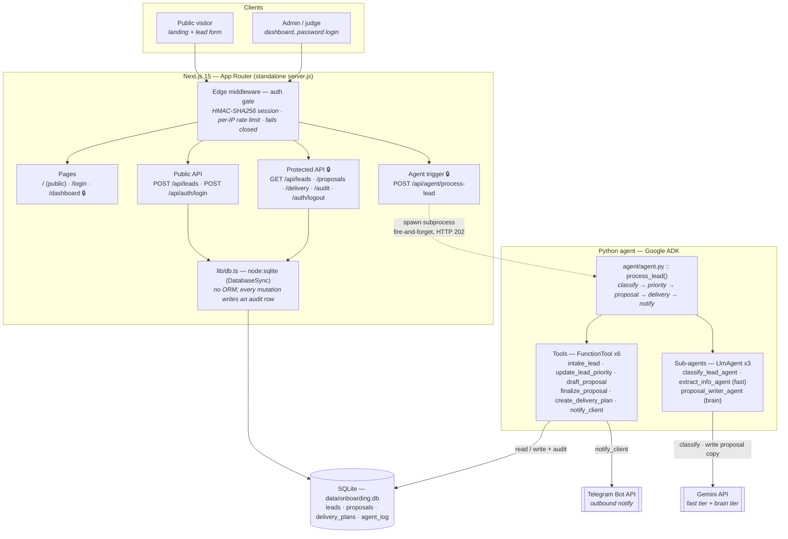

# Architecture — Client Onboarding Agent

A single deployable unit runs two cooperating runtimes: a **Next.js 15** server
(UI + API) and a **Python Google ADK** agent that the API spawns per lead. They
share one SQLite database and one audit trail.


> The SVG above is standalone (no external assets) and renders in any browser.
> The Mermaid source below is the same system, kept in sync for diffability.

---

## System diagram



---

## Request → agent handoff

The API never runs model calls inline. `POST /api/agent/process-lead` validates
the id, flips the lead to `processing`, spawns the agent, and returns **202**
immediately; the browser then polls `GET /api/leads` for status.

```
POST /api/agent/process-lead {lead_id}
  → markLeadProcessing()                       status: processing
  → spawn <cwd>/.venv/bin/python -m agent.agent --lead-id N
  → 202 Accepted                               (client polls from here)

agent process_lead(N):
  1. classify         classify_lead_agent (fast) ── or offline heuristic
  2. update_lead_priority                      status: classified
  3. draft_proposal   → skeleton row
  4. proposal_writer_agent (brain) → strict JSON copy
     finalize_proposal                         status: proposal_ready
  5. create_delivery_plan   discovery → build → review → handover
  6. notify_client    Telegram, or console-log fallback
```

`process.cwd()` is the project root for that spawn, which is why `.venv/` and
`agent/` must sit beside `server.js` — see [Deployment](#deployment-topology).

## Model placement

Two tiers, both read from the environment — no model id is hardcoded outside
its `.env` default.

| Sub-agent | Model var | Work |
| --- | --- | --- |
| `classify_lead_agent` | `GEMINI_FAST_MODEL` | Lead priority: hot / warm / cold |
| `extract_info_agent` | `GEMINI_FAST_MODEL` | Unstructured text → structured lead fields |
| `proposal_writer_agent` | `GEMINI_BRAIN_MODEL` | Overview / scope / timeline / pricing copy |

Without `GEMINI_API_KEY` the pipeline runs a deterministic offline path
(budget/service heuristic + skeleton proposal), so the whole system is testable
and demonstrable with no key and no network.

## Data model

One SQLite file, four tables, written by both runtimes.

| Table | Holds |
| --- | --- |
| `leads` | name, email, service, budget, priority, status, created_at |
| `proposals` | lead_id, overview, scope, timeline, pricing, status |
| `delivery_plans` | lead_id, steps_json (discovery → build → review → handover) |
| `agent_log` | actor, action, target, detail, created_at — **append-only audit trail** |

Both sides agree on the file: Node reads `DB_PATH`; `agent/memory.py` derives
`<agent/>/../data/onboarding.db`. In the container both resolve to
`/app/data/onboarding.db` — this is why `DB_PATH` must not be repointed.

Every state change writes an `agent_log` row, including rejections
(`intake_lead_rejected`, `auth_login_rejected`, …). The dashboard's audit card
renders that table directly, so the security trail is visible, not just stored.

## Security

| Control | Implementation |
| --- | --- |
| Admin auth | scrypt password derivation, `timingSafeEqual` comparison — never `===` |
| Session | HMAC-SHA256 signed cookie, 24h expiry, httpOnly, SameSite=Lax, Secure in prod |
| Route protection | One `middleware.ts` gate; APIs get 401 JSON, pages redirect to `/login` |
| Rate limiting | Login 5/60s per IP; public lead intake 10/60s per IP |
| Fail closed | Any missing auth env var ⇒ every protected route denies |
| Audit | Append-only `agent_log`; passwords never recorded |
| Secrets | `.env` / `.env.production` gitignored; templates ship empty |

**Runtime split (deliberate):** middleware runs on the Edge runtime, so sessions
are verified with Web Crypto (`crypto.subtle`), available in both Edge and Node.
scrypt lives in `lib/password.ts`, imported only by the login route, which pins
`runtime = "nodejs"` — webpack resolves `node:` schemes statically, so any path
from middleware to `node:crypto` breaks the Edge build outright.

## Deployment topology

One image, two runtimes. `WORKDIR /app` is load-bearing.

```
/app
├── server.js          Next.js standalone entrypoint  (node server.js)
├── .next/static       client assets
├── agent/             Python ADK package
├── .venv/             Linux venv — process-lead spawns .venv/bin/python
└── data/              SQLite volume mount
```

| Target | Status | Notes |
| --- | --- | --- |
| **Docker + Traefik on VPS** | Current | `docker compose up -d`, loopback-bound `127.0.0.1:3018`, `./data` volume persists SQLite |
| **Google Cloud Run** | Ready, not deployed | Container is PORT-driven and stateless-safe; see [cloud-run-deploy.md](./cloud-run-deploy.md). Billing not yet enabled on the project |

On Cloud Run the container listens on the injected `PORT` (the standalone
server reads `process.env.PORT`, defaulting to 3000 locally). SQLite there is
**ephemeral** — see the deploy guide for what that means for a demo.
